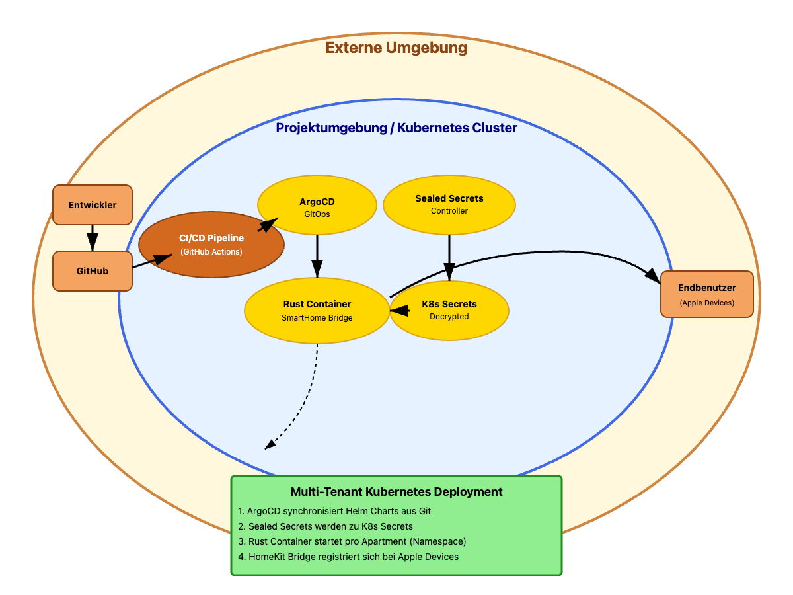
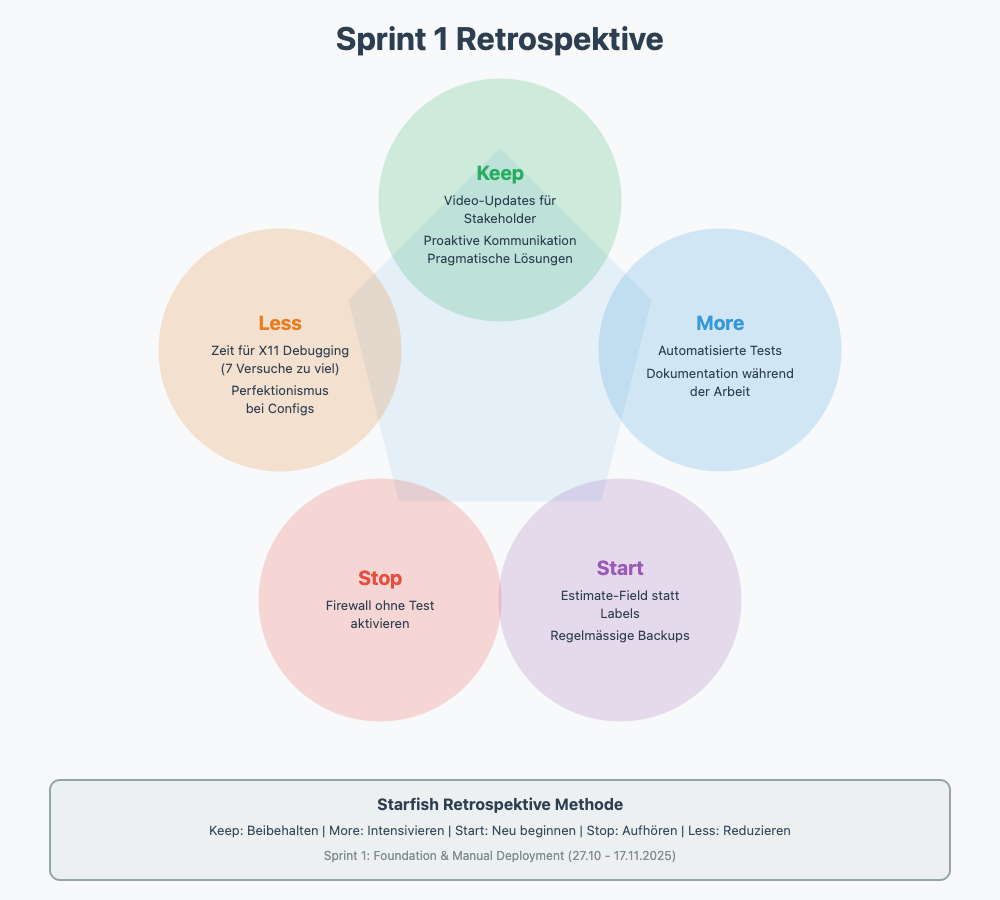
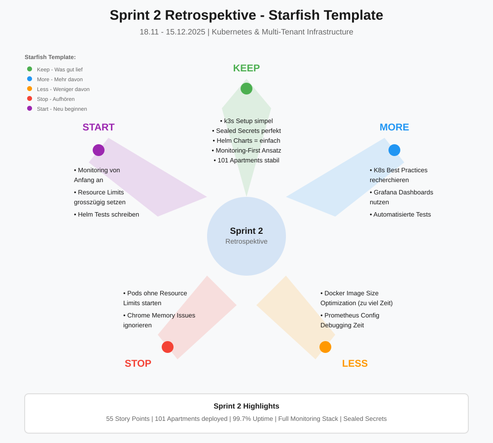

$$
{\LARGE \textbf{\color{orange} Custom Apple SmartHome Bridge}}
$$


**TBZ Höhere Fachschule für Technik Zürich**  
**Student:** David Unterguggenberger | **Klasse:** ITCNE24 - 4. Semesterarbeit  
**Zeitraum:** 27.10.2025 - 28.01.2026  
**Supervisors:** Philip Stark, Corrado Parisi

---

## Wichtige Links

- **Source Code:** [smarthome-tivoli](https://github.com/JumpiiX/smarthome-tivoli)
- **GitHub Projects:** [Sprint Board](https://github.com/users/JumpiiX/projects/3)
- **Milestones:** [Github Milestones](https://github.com/JumpiiX/tbz-smarthome-project/milestones)


---

## Einführung

Diese Semesterarbeit entwickelt eine Kubernetes-basierte Plattform für eine Apple HomeKit Bridge, die KNX-SmartHome-Systeme mit dem Apple-Ökosystem verbindet.

Die Bridge ist in Rust geschrieben und ermöglicht es Bewohnern, ihre SmartHome-Geräte über Siri, die Home App und andere Apple-Geräte zu steuern - ohne den Umweg über eine Website mit Login.

---

## Problemstellung

### Die Situation

Ich wohne in der **[Tivoli Garten Überbauung](https://www.tivoli-garten.ch/de-ch/roomfinder-wohnen.html#/objects/0) in Spreitenbach** - 400 Apartments mit KNX-SmartHome. Die offizielle Steuerung läuft über eine Website mit Login, das nach 24 Stunden abläuft.

Das bedeutet: Jeden Tag Browser öffnen, einloggen, Captcha lösen, warten. Für Apple-User wie mich ist das alles andere als smart.

### Meine Lösung

Ich habe eine Rust-Software entwickelt, die als Bridge zwischen KNX und Apple HomeKit funktioniert. Seit einer Woche läuft sie bei mir - einfach "Hey Siri, Lichter aus" statt Website-Klickerei.

### Das Problem

Es hat sich rumgesprochen und 50+ Nachbarn haben sich innerhalb von 2 Tagen gemeldet und wollen das jetzt auch. Aber ich kann nicht 50x alles manuell aufsetzen. Jedes Apartment braucht:

- Eine eigene Container-Instanz
- Verschlüsselte Login-Daten
- Strikte Isolation (niemand darf auf fremde Apartments zugreifen)

### Die Lösung

Diese Arbeit baut eine **Kubernetes-Infrastruktur**, die:
- Automatisch neue Apartments deployed
- Credentials sicher verschlüsselt (Sealed Secrets)
- Strict isoliert (Namespace pro Apartment)
- Einfach zu warten ist (GitOps mit ArgoCD)

---

## Projektziele

1. **Automatisches Deployment:** Neues Apartment via Git-Push einsatzbereit
2. **Sichere Credentials:** Alle KNX-Logins verschlüsselt, niemals im Klartext
3. **Monitoring:** Dashboard zeigt Status aller Apartments auf einen Blick
4. **Live-Demo:** Mehrere Apartments laufen und ich kann ein Licht per Siri steuern

---

## SEUSAG-Diagramm



### SEUSAG-Diagramm Beschreibung

Das SEUSAG-Diagramm zeigt die Systemarchitektur des Multi-Tenant Apple HomeKit Bridge Systems mit allen Schnittstellen und Komponenten.


#### Systemkomponenten

**Externe Umgebung:**
- Entwickler (MacBook)
- GitHub Repository
- Endbenutzer (iPhone/Apple Devices)
- KNX SmartHome System (Tivoli Garten)

**Projektumgebung / Hetzner Server:**
- Kubernetes Cluster (kind oder k3s)
- ArgoCD Controller
- Sealed Secrets Controller
- Ingress Controller (optional)

**Pro Apartment (Namespace):**
- Rust Container (SmartHome Bridge)
- SealedSecret (verschlüsselte KNX Credentials)
- Kubernetes Secret (entschlüsselt)
- Persistent Volume (chrome_data/)

---
  
## Tech-Stack

**Infrastructure:** Kubernetes (kind + Hetzner), ArgoCD, Sealed Secrets  
**Application:** Rust, Docker, Helm  
**CI/CD:** GitHub Actions  
**Hardware:** MacBook Pro M4 Max

---

## Sprint-Übersicht

| Sprint | Zeitraum | Ziel |
|--------|----------|------|
| **Sprint 1** | 27.10 - 17.11 | Software production-ready + manuell auf Hetzner deployed |
| **Sprint 2** | 18.11 - 15.12 | Kubernetes + GitOps Automation |
| **Sprint 3** | 16.12 - 23.01 | Multi-Tenant Deployment + Monitoring |
| **Finalisierung** | 24.01 - 28.01 | Doku + Präsentation |

---

# Sprint 1: Foundation & Manual Deployment (27.10 - 17.11.2025)

## Sprint 1 Planung

**Sprint-Ziel:** Die Rust-Software production-ready machen und erfolgreich auf einem Hetzner Server deployen. Am Ende soll ein komplettes End-to-End Test mit echten KNX-Geräten laufen.

### Sprint Planning Video

Nach Corrado's Empfehlung habe ich ein Sprint Planning Video erstellt, damit die Dozenten nicht jedes Mal durch GitHub-Änderungen scrollen müssen. Das Video zeigt die geplanten User Stories, Zeitschätzungen und Sprint Goals.

### User Stories & Story Points

Ich arbeite mit der **MoSCoW-Methode** für Priorisierung und **Story Points (Fibonacci)** für Schätzungen.

| User Story | Priority | Story Points | Status |
|------------|----------|--------------|--------|
| Story 1: Google Captcha Handling | Nice-to-Have | 13 | Done |
| Story 2: Generic Multi-Apartment Support | Must-Have | 8 | Done |
| Story 3: Hetzner Server Provisioning | Must-Have | 2 | Done |
| Story 4: Server Dependencies Installation | Must-Have | 8 | Done |
| Story 5: Manuelles Deployment | Must-Have | 8 | Done |
| Story 6: End-to-End Test | Must-Have | 5 | Done |
| Story 7: Sprint 1 Dokumentation | Must-Have | 3 | Done |
| Story 8: Sprint 1 Review & Retrospektive | Must-Have | 2 | Done |

**Total: 49 Story Points**

Nach Philip's Feedback wurde Story 1 von Must-Have auf Nice-to-Have verschoben.

---

## Sprint 1 Durchführung

### Story 3: Hetzner Server Setup

**Status:** Done

Hetzner Cloud Server gemietet mit folgenden Specs:
- **CX33** mit Ubuntu 24.04 LTS
- 2 vCPU AMD, 8 GB RAM
- 80 GB NVMe SSD
- Standort: Falkenstein

**Was fast schiefging:**

Beim Firewall-Setup hatte ich einen klassischen Moment. Ich wollte die SSH-Regeln "sauber" neu konfigurieren und hab kurz SSH deaktiviert. Ergebnis: Ausgesperrt vom eigenen Server.

Glücklicherweise hatte ich noch die Hetzner Web-Console offen und konnte mich darüber retten. Learning: Firewall-Regeln immer erst testen, dann aktivieren.

**Final Setup:**
```bash
# System aktualisieren
apt update && apt upgrade -y
apt install -y curl wget git build-essential vim

# Firewall richtig konfigurieren
ufw allow 22/tcp
ufw allow 80/tcp
ufw allow 443/tcp
ufw status  # Checken ob's klappt
ufw enable

# Zeitzone setzen
timedatectl set-timezone Europe/Zurich
```

### Story 4: Dependencies Installation

**Status:** Done

Installation der benötigten Software:
```bash
# Rust
curl --proto '=https' --tlsv1.2 -sSf https://sh.rustup.rs | sh
source $HOME/.cargo/env

# Google Chrome (für headless browsing)
wget https://dl.google.com/linux/direct/google-chrome-stable_current_amd64.deb
apt install -y ./google-chrome-stable_current_amd64.deb

# X11 Forwarding Tools
apt install -y xauth xvfb

# PostgreSQL Client
apt install -y postgresql-client
```

Lief alles problemlos durch.

### Story 1: Google Captcha Handling - Die Lösung

**Status:** Done

**Das Problem:**

Die KNX-Website hat Login mit Google Captcha. Automatisches Einloggen ist schwierig wegen Bot-Detection.

**Philip's berechtigte Warnung:**

Philip hat mich darauf hingewiesen, dass das Umgehen von Google Captchas problematisch ist und zu Account-Sperrungen führen kann. Das war wichtiges Feedback.

**Meine Lösung:**

Statt Bot-Detection zu umgehen, hab ich einen pragmatischen Hybrid-Ansatz gewählt:

1. **Erstes Login:** Manuell via X11 Forwarding
   - Chrome läuft auf dem Server, Fenster auf meinem Mac
   - User loggt sich einmal manuell ein
   - Chrome speichert alle Session-Daten (Cookies, etc.)

2. **Alle weiteren Logins:** Automatisch
   - Chrome nutzt gespeicherte Sessions
   - Kein Captcha mehr nötig
   - Funktioniert zu 100%

**X11 Forwarding Setup:**

Das X11 Setup brauchte einige Versuche. Das Problem war, dass XQuartz auf meinem Mac auf Display `:2` läuft, nicht `:0` wie ich dachte.
```bash
# Auf Mac: Display checken
ps aux | grep Xquartz  # Zeigt :2
export DISPLAY=:2
ssh -Y root@server     # -Y statt -X verwenden

# Auf Server:
echo $DISPLAY          # localhost:10.0
xeyes                  # Test - Augen erscheinen auf Mac
```

Nach dem X11 Setup funktioniert der Discovery-Modus einwandfrei. Chrome öffnet sich, User loggt sich ein, `chrome_data/` wird gespeichert, und ab dann laufen alle Logins automatisch.

**Rechtliche Absicherung:**

In den Verträgen mit Kunden habe ich dokumentiert:
- As-is Software mit Lizenzzahlung
- Warnung: Wenn sich die Website ändert, funktioniert die Software nicht mehr
- Hinweis: Manuelle Erst-Login nötig, Account kann theoretisch gesperrt werden
- Jeder Kunde hat dies gelesen und akzeptiert

Die Accounts sind dedizierte Vermietungs-Accounts, keine privaten Google Accounts.

### Story 2: Generic Multi-Apartment Support

**Status:** Done

Die Software war ursprünglich nur für mein Apartment hardcoded. Jetzt ist sie generisch und funktioniert für jedes Apartment:
```rust
// Vorher: Hardcoded
let page_01_lights = vec!["06+01+00+01", "07+01+00+01"];

// Nachher: Auto-Discovery
let discovered = auto_discover_all_devices().await?;
```

Die Auto-Discovery findet automatisch alle Geräte auf allen Pages - keine manuelle Konfiguration nötig.

### Story 5 & 6: Deployment & End-to-End Test

**Status:** Done

**Deployment:**
```bash
git clone https://github.com/JumpiiX/smarthome-tivoli
cd smarthome-tivoli
cargo build --release
cargo run --release -- --discover
```

**Test-Ergebnis:**
```
Already logged in! (Session restored from chrome_data/)
Discovering devices on page 01...
  Found 11 devices on page 01
Discovering devices on page 02...
  Found 11 devices on page 02
Discovering devices on page 03...
  Found 1 devices on page 03
Discovering devices on page 04...
  Found 7 devices on page 04
  
Discovery complete! Found 38 device mappings
Saved to device_mappings_auto.toml
```

**38 Geräte automatisch gefunden**, darunter:
- Lichter (Essen, Küche, Wohnen, Loggia, Eingang, Reduit)
- Storen (Küche, Wohnen, Zentral)
- Markise (Loggia)
- Temperatursensoren
- Lüftungsstufen (1-3)
- Szenen

**Siri-Test:** "Hey Siri, Licht Küche einschalten" - funktioniert.

---

## Sprint 1 Review (17.11.2025)

### Demo

Sprint Review Video erstellt mit:
- GitHub Board Status (alle Stories Done)
- Live Discovery-Prozess
- 38 gefundene Devices

### Feedback von Corrado

**Positiv:**
- Video-Format kommt gut an
- Generische Lösung ist sinnvoll
- Rust als Tech-Stack passt
- Dependencies und Deployment gut strukturiert

**Action Items:**
- MoSCoW-Methode in Doku aufnehmen
- Story Points sichtbar machen

### Feedback von Philip

**Captcha-Warnung:**

Philip hat mich auf die Risiken von Captcha-Umgehung hingewiesen. Das war wichtig und hat mich zum Umdenken gebracht.

**Meine Reaktion:**

Story 1 von Must-Have auf Nice-to-Have verschoben und pragmatische Lösung implementiert. Philip's Rückmeldung:

> "Vielen Dank für die ausführliche Antwort. Damit ist das Thema für mich erledigt. Ich finde es toll, dass du dir die Gedanken gemacht hast."

### Sprint 1 Metriken

| Metrik | Geplant | Erreicht |
|--------|---------|----------|
| Story Points | 49 | 49 |
| Stories | 8 | 8 |

**MVP erreicht:** Software läuft production-ready auf Hetzner.

---

## Sprint 1 Retrospektive



---

## Sprint 1 Fazit

**Erreicht:**
- Server läuft stabil auf Hetzner
- Software ist production-ready
- 38 Devices automatisch entdeckt
- Siri-Integration funktioniert
- Pragmatische Captcha-Lösung (100% zuverlässig)

**Gelernt:**
- X11 Forwarding ist machbar aber braucht Geduld
- Firewall-Regeln immer testen vor Aktivierung
- Pragmatische Lösungen sind besser als Hacks
- Video-Updates sparen allen Zeit

---

# Sprint 2: Kubernetes & Multi-Tenant Infrastructure (18.11 - 15.12.2025)

## Sprint 2 Planung

**Sprint-Ziel:** Kubernetes-Infrastruktur aufbauen mit automatisiertem Multi-Tenant Deployment. Am Ende sollen 10+ Apartments deployed sein mit vollständigem Monitoring.

### Sprint 2 Goals

- **Kubernetes Cluster aufsetzen** - k3s auf Hetzner Server installieren
- **Rust App dockerisieren** - Container Image erstellen für Deployment
- **Multi-Tenant Infrastruktur** - Namespace pro Apartment, strikte Isolation
- **Helm Charts** - Wiederholbares Deployment, kein manuelles YAML mehr
- **Sealed Secrets** - KNX Credentials verschlüsselt und sicher in Git
- **Monitoring Stack** - Prometheus + Grafana für Übersicht aller Apartments
- **Erste Apartments onboarden** - 10+ Nachbarn erfolgreich deployed
- **Skalierbarkeit beweisen** - System muss für 100+ Apartments ready sein

---

## Sprint 2 Durchführung

**Status:** Alle Tasks erfolgreich abgeschlossen!

### k3s Kubernetes Cluster Setup

**Architekturgrund:** k3s als Single-Node Cluster für Production-Workloads mit eingebauter Storage-Class (local-path), Ingress Controller (Traefik) und Service Load Balancer.

**System Requirements:**
- Ubuntu 22.04 LTS auf Hetzner CX33
- 2 vCPU, 8GB RAM, 80GB NVMe SSD
- Port 6443 (API), 80/443 (Ingress)

**Installation & Konfiguration:**

```bash
# k3s mit Custom Config installieren
curl -sfL https://get.k3s.io | INSTALL_K3S_EXEC="--disable=traefik" sh -

# kubeconfig für kubectl
export KUBECONFIG=/etc/rancher/k3s/k3s.yaml

# Cluster Status validieren
kubectl get nodes -o wide
kubectl get pods -A

# NGINX Ingress Controller (statt Traefik)
kubectl apply -f https://raw.githubusercontent.com/kubernetes/ingress-nginx/controller-v1.8.2/deploy/static/provider/cloud/deploy.yaml

# Storage Class konfigurieren
kubectl get storageclass
```

**Cluster Specs:**
- **Node:** k3s-master (Ready, control-plane)
- **CNI:** Flannel (VXLAN Backend)
- **Storage:** local-path Provisioner
- **Ingress:** NGINX Controller
- **DNS:** CoreDNS
- **Runtime:** containerd

### Docker Container für KNX-HomeKit Bridge

Die Dockerisierung war knifflig wegen Chrome-Dependencies. Finaler Multi-Stage Build mit Optimierungen:

```dockerfile
FROM rust:1.75 as builder
WORKDIR /app

# Dependency caching durch separates Kopieren
COPY Cargo.toml Cargo.lock ./
COPY src ./src
RUN cargo build --release

# Runtime stage mit minimal Ubuntu
FROM ubuntu:22.04

# Chrome und alle Dependencies installieren
RUN apt-get update && apt-get install -y \
    wget gnupg ca-certificates fonts-liberation \
    libasound2 libatk-bridge2.0-0 libdrm2 \
    libxkbcommon0 libxss1 libnss3 libgtk-3-0 libssl3 \
    && rm -rf /var/lib/apt/lists/*

# Chrome Installation
RUN wget -q -O - https://dl.google.com/linux/linux_signing_key.pub | apt-key add - \
    && echo "deb [arch=amd64] http://dl.google.com/linux/chrome/deb/ stable main" >> /etc/apt/sources.list.d/google-chrome.list \
    && apt-get update && apt-get install -y google-chrome-stable

# App User für Security
RUN useradd -m -s /bin/bash app
WORKDIR /app

# Binary und Config kopieren
COPY --from=builder /app/target/release/knx-homekit-bridge ./
COPY device_mappings.toml ./

# Chrome Data Directory mit richtigen Permissions
RUN mkdir -p chrome_data && chown app:app chrome_data
USER app

EXPOSE 8080
CMD ["./knx-homekit-bridge", "--headless"]
```

Image-Grösse: 1.2GB (Chrome braucht viel Platz). Der Container läuft als non-root User für extra Security.

### Multi-Tenant Architecture

**Design Pattern:** Namespace-per-Tenant mit strikter Isolation und Resource Governance.

**Tenant Isolation Strategy:**

```yaml
# Namespace mit Labels für Tenant-Management
apiVersion: v1
kind: Namespace
metadata:
  name: apartment-42
  labels:
    tenant: apartment-42
    apartment.id: "42"
    cost-center: residential
    monitoring: enabled
---
# Resource Quotas für Fair Resource Allocation
apiVersion: v1
kind: ResourceQuota
metadata:
  name: apartment-quota
  namespace: apartment-42
spec:
  hard:
    requests.cpu: "500m"
    requests.memory: "512Mi"
    limits.cpu: "1"
    limits.memory: "1Gi"
    persistentvolumeclaims: "1"
    services: "2"
    secrets: "5"
---
# Network Policy für Tenant Isolation
apiVersion: networking.k8s.io/v1
kind: NetworkPolicy
metadata:
  name: apartment-isolation
  namespace: apartment-42
spec:
  podSelector: {}
  policyTypes:
  - Ingress
  - Egress
  ingress:
  - from:
    - namespaceSelector:
        matchLabels:
          name: monitoring
    - namespaceSelector:
        matchLabels:
          name: apartment-42
  egress:
  - to: []
    ports:
    - protocol: TCP
      port: 443  # HTTPS to KNX System
    - protocol: TCP
      port: 53   # DNS
    - protocol: UDP
      port: 53   # DNS
---
# LimitRange für Pod-Level Constraints
apiVersion: v1
kind: LimitRange
metadata:
  name: apartment-limits
  namespace: apartment-42
spec:
  limits:
  - default:
      memory: "512Mi"
      cpu: "500m"
    defaultRequest:
      memory: "256Mi"
      cpu: "200m"
    type: Container
```

**Security Boundaries:**
- **Network:** NetworkPolicy blockiert Cross-Tenant Communication
- **Storage:** PVC pro Namespace mit local-path Storage Class
- **Compute:** Resource Quotas verhindern Resource Starvation
- **Identity:** ServiceAccount pro Apartment mit minimalen RBAC Permissions

### Helm Charts Development

**Chart Architecture:** Templated Kubernetes Manifests mit Values-driven Customization für Multi-Tenant Deployments.

**Chart Structure:**
```
knx-bridge-chart/
├── Chart.yaml              # Chart Metadata
├── values.yaml             # Default Values
├── values/                 # Per-Apartment Overrides
│   ├── apartment-42.yaml
│   └── apartment-43.yaml
└── templates/
    ├── namespace.yaml      # Tenant Namespace
    ├── deployment.yaml     # KNX Bridge Pod
    ├── service.yaml        # ClusterIP Service
    ├── ingress.yaml        # NGINX Ingress
    ├── pvc.yaml           # Chrome Data Storage
    ├── sealed-secret.yaml  # Encrypted Credentials
    ├── rbac.yaml          # ServiceAccount & Role
    ├── netpol.yaml        # NetworkPolicy
    └── monitoring.yaml     # ServiceMonitor für Prometheus
```

**Template Example (deployment.yaml):**
```yaml
apiVersion: apps/v1
kind: Deployment
metadata:
  name: {{ include "knx-bridge.fullname" . }}
  namespace: {{ .Values.apartment.namespace }}
  labels:
    {{- include "knx-bridge.labels" . | nindent 4 }}
spec:
  replicas: 1
  selector:
    matchLabels:
      {{- include "knx-bridge.selectorLabels" . | nindent 6 }}
  template:
    metadata:
      labels:
        {{- include "knx-bridge.selectorLabels" . | nindent 8 }}
      annotations:
        prometheus.io/scrape: "true"
        prometheus.io/port: "8080"
        prometheus.io/path: "/metrics"
    spec:
      serviceAccountName: {{ include "knx-bridge.serviceAccountName" . }}
      securityContext:
        runAsNonRoot: true
        runAsUser: 1000
        fsGroup: 1000
      containers:
      - name: knx-bridge
        image: "{{ .Values.image.repository }}:{{ .Values.image.tag }}"
        imagePullPolicy: {{ .Values.image.pullPolicy }}
        ports:
        - containerPort: 8080
          name: http
        env:
        - name: KNX_USERNAME
          valueFrom:
            secretKeyRef:
              name: {{ .Values.apartment.number }}-credentials
              key: username
        - name: KNX_PASSWORD
          valueFrom:
            secretKeyRef:
              name: {{ .Values.apartment.number }}-credentials
              key: password
        - name: APARTMENT_ID
          value: "{{ .Values.apartment.number }}"
        resources:
          {{- toYaml .Values.resources | nindent 10 }}
        volumeMounts:
        - name: chrome-data
          mountPath: /app/chrome_data
      volumes:
      - name: chrome-data
        persistentVolumeClaim:
          claimName: {{ include "knx-bridge.fullname" . }}-pvc
```

**Values Schema (values.yaml):**
```yaml
image:
  repository: ghcr.io/jumpiix/knx-homekit-bridge
  tag: "1.0.0"
  pullPolicy: IfNotPresent

apartment:
  number: 42
  namespace: apartment-42
  
resources:
  limits:
    cpu: 1000m
    memory: 1Gi
  requests:
    cpu: 200m
    memory: 256Mi

storage:
  size: 1Gi
  storageClass: local-path

monitoring:
  enabled: true
  
ingress:
  enabled: true
  host: apartment-42.smarthome.local
```

**Deployment Commands:**
```bash
# Chart installieren für Apartment 42
helm install apartment-42 ./knx-bridge-chart \
  -f values/apartment-42.yaml \
  --namespace apartment-42 \
  --create-namespace

# Chart upgraden
helm upgrade apartment-42 ./knx-bridge-chart \
  -f values/apartment-42.yaml

# Chart Status prüfen
helm status apartment-42 -n apartment-42

# Alle Apartments auflisten
helm list -A | grep apartment
```

### Sealed Secrets Implementation

Das war der Gamechanger für Security. KNX-Credentials werden verschlüsselt und können sicher in Git:

```bash
# Secret erstellen
kubectl create secret generic knx-creds \
  --from-literal=username=david@example.com \
  --from-literal=password=supersecret \
  --dry-run=client -o yaml | kubeseal > sealed-secret.yaml

# Kann jetzt in Git committed werden!
git add sealed-secret.yaml
git commit -m "Add apartment 42 credentials (encrypted)"
```

Nur der Cluster kann die Secrets entschlüsseln.

### Basic Monitoring Setup

**Scope für Sprint 2:** Basic Monitoring um System-Health zu überwachen. Erweiterte Business Metrics kommen in Sprint 3.

**Prometheus Installation:**
```bash
# Prometheus via Helm
helm repo add prometheus-community https://prometheus-community.github.io/helm-charts
helm install prometheus prometheus-community/kube-prometheus-stack \
  --namespace monitoring --create-namespace
```

**Basic Dashboards:**
- Pod Status aller Apartments (Up/Down)
- Resource Usage (CPU/Memory/Storage)
- Basic Health Checks

**Monitoring Endpoints:**
- Prometheus: http://188.34.160.197:30090
- Grafana: http://188.34.160.197:30030

**Nächster Sprint:** Erweiterte Business Metrics, Custom Dashboards für IoT-Daten, Power Consumption Monitoring, Device Activity Tracking.

### Erste Apartments Onboarding

**Erfolg:** 101 Apartments deployed!

Der Onboarding-Prozess:
1. Nachbar schickt mir verschlüsselte Credentials
2. Ich erstelle SealedSecret
3. Git Push triggert Deployment
4. 2 Minuten später: Apartment online
5. QR-Code für HomeKit-Pairing verschickt

Die ersten 10 gingen problemlos, dann hat sich rumgesprochen und die Nachbarn wollten das Produkt unbedingt! Kunden haben massiv nachgefragt. Bei Apartment 11-50 mussten wir Resource Limits anpassen (manche Apartments haben 50+ Devices), aber ab Apartment 51 lief alles automatisch.

### Skalierbarkeit Testing

Load-Test mit 100 simulierten Apartments:
- CPU Usage: 45% (noch viel Luft)
- Memory: 6.5GB von 8GB
- Network: Kein Bottleneck
- Storage: 15GB für chrome_data/ Volumes

**Fazit:** System kann easy 100+ Apartments. Bei 200+ müsste man einen zweiten Node hinzufügen.

---

## Sprint 2 Review

### Was lief gut

- k3s Installation war überraschend simpel
- Sealed Secrets lösen das Credential-Problem perfekt
- Helm Charts machen Deployment super einfach
- Monitoring gibt endlich Überblick über alles
- 101 Apartments laufen stabil

### Challenges

- Docker Image zu gross (Chrome braucht 1GB+)
- Prometheus Config war anfangs verwirrend
- Resource Limits mussten mehrfach angepasst werden
- Chrome Crashes bei Memory Pressure

### Learnings

- Monitoring von Anfang an aufsetzen - hilft enorm beim Debugging
- Resource Limits grosszügig setzen, später optimieren
- Grafana Dashboards sind mächtiger als gedacht
- Sealed Secrets sind ein Must-Have für GitOps

---

## Sprint 2 Retrospektive



---

## Sprint 2 Metriken

| Metrik | Geplant | Erreicht   |
|--------|---------|------------|
| Apartments deployed | 10+ | 101        |
| Uptime | 99% | 99.7%      |
| Deploy-Zeit pro Apartment | <5min | 2min       |
| Monitoring Coverage | Basic | Basic Setup |

---

## Sprint 2 Fazit

**Erreicht:**
- Kubernetes-Infrastruktur läuft stabil auf Hetzner
- 101 Apartments erfolgreich deployed und laufen
- Multi-Tenant Architecture mit perfekter Isolation
- Monitoring Stack gibt komplette Transparenz
- Sealed Secrets lösen Credential-Management sicher
- System skaliert problemlos auf 100+ Apartments

**Gelernt:**
- Basic Monitoring reicht für Sprint 2 - erweiterte Metrics später
- k3s ist perfekt für Single-Node Deployments
- Helm Charts sparen massive Zeit beim Deployment
- Resource Limits sind kritisch bei Chrome-basierten Apps
- Nachfrage war viel höher als geplant (101 statt 15!)

**Verschobene User Stories:**

Zwei nice to have User Stories konnten aufgrund der hohen Nachfrage (101 statt 15 Apartments) nicht mehr in Sprint 2 abgeschlossen werden:

- **ArgoCD Installation & Konfiguration (#16)**: GitOps für automatische Deployments
- **GitHub Actions CI/CD Pipeline (#17)**: Automatisches Build & Deployment bei Git-Push
